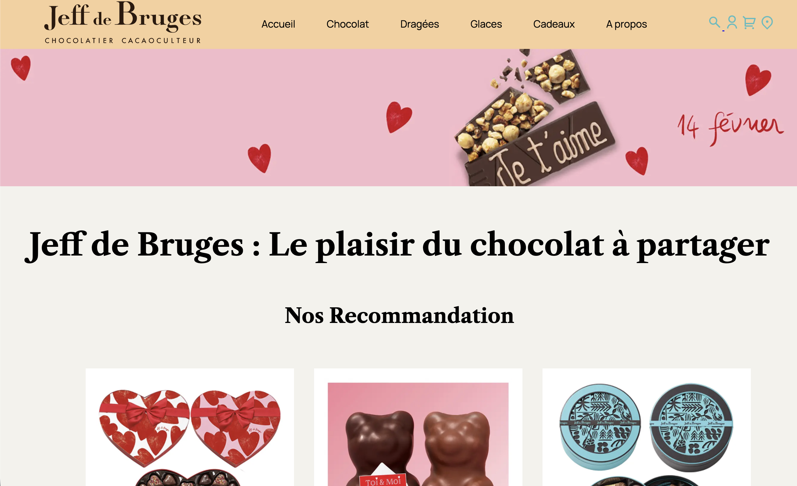

# Intégration maquette figma

Intégration d'une maquette Figma en HTML et CSS de trois pages : Accueil, Produits, Contact.

Les pages sont accessibles via les liens suivants :
- [Accueil](https://nino-rameau.github.io/integration_maquette/)
- [Produits](https://nino-rameau.github.io/integration_maquette/categorie_chocolat.html)
- [Contact](https://nino-rameau.github.io/integration_maquette/contact.html)

## Sommaire

1. [Technologies utilisées](#technologies-utilisées)
2. [Déploiement](#déploiement)
3. [Aperçu](#aperçu)
4. [Auteur](#auteur)
5. [Licence](#licence)

## Technologies utilisées

- **HTML** : Permet de structurer le contenu des pages web.
- **CSS** : Utilisé pour styliser et mettre en forme les pages web.

## Déploiement

L'intégration est visible sur : [ce lien](https://nino-rameau.github.io/integration_maquette/).

## Aperçu

## Auteur

**[Nino Rameau](https://nino-rameau.fr)** - [LinkedIn](https://www.linkedin.com/in/nino-rameau-1a0636332/) - [GitHub](https://github.com/Nino-Rameau)

## Licence

Réalisé dans le cadre scolaire de partiel en janvier 2026.